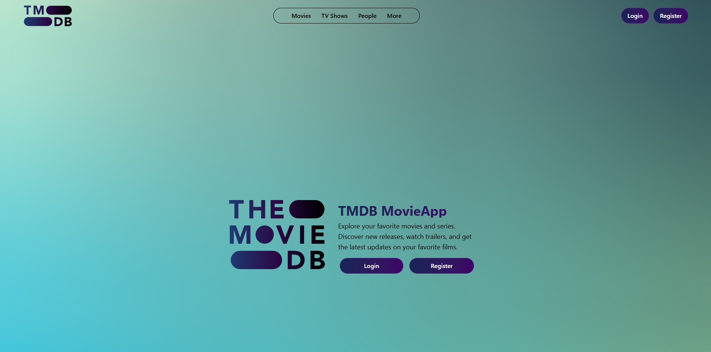
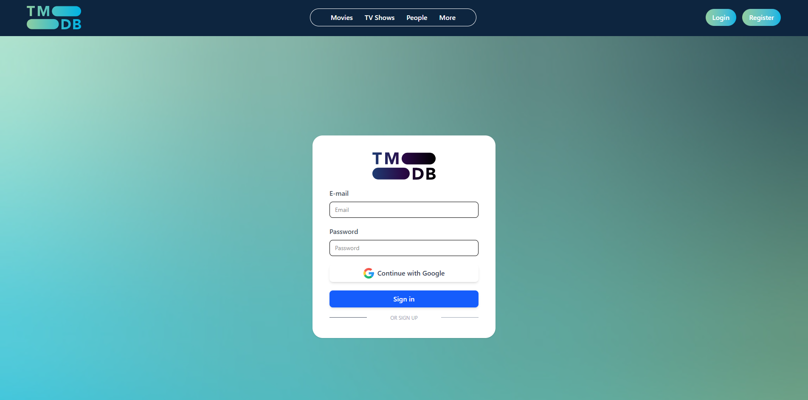
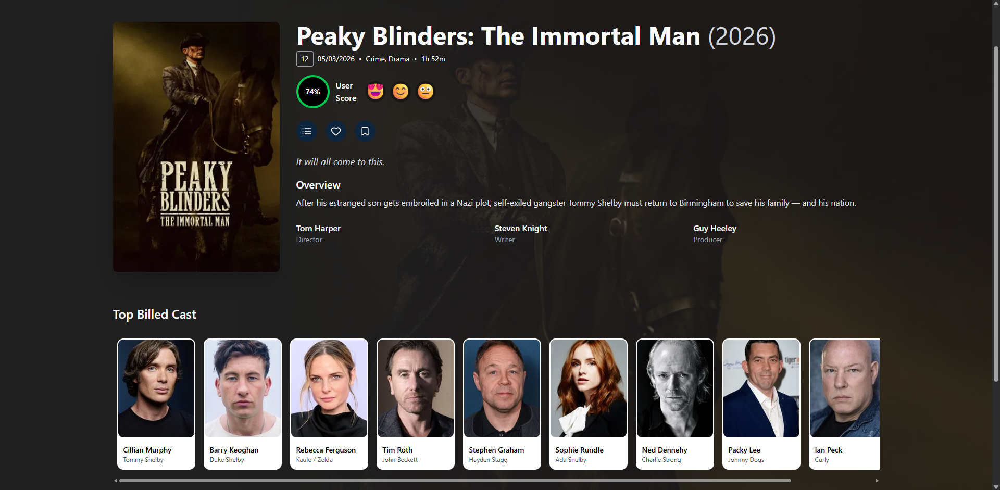
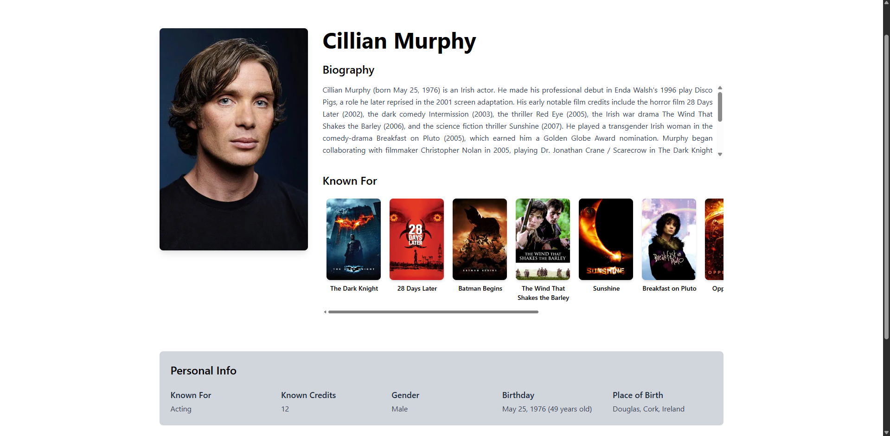

# Release: TMDB MovieApp

## 📋 **Description**
This major release consolidates all developed features into a complete movie discovery application. The develop branch now includes authentication, movie details, and actor information pages, providing a comprehensive TMDB-powered movie experience.

## 🎥 Preview

### 🎬 MovieApp Preview


---

### 🏠 Home Page


---

### 🔐 Authentication Page


---
### 📔 Movie List Page


---

### 🎞️ Movie Page


---

### 🦸 Actor Page


---


## 🎯 **Major Features Included**

### 🔐 **Authentication System** (PR #5)
- **User Registration & Login**: Complete Firebase authentication integration
- **Protected Routes**: Secure access to movie content
- **Auth Context**: Global authentication state management
- **Persistent Sessions**: User state maintained across browser sessions

### 🎬 **Movie Details Page** (PR #6)
- **TMDB Integration**: Real-time movie data from The Movie Database
- **Complete Movie Info**: Posters, overview, ratings, cast, and crew
- **Responsive Design**: Optimized for all device sizes
- **Interactive Elements**: Ratings, bookmarks, and user actions

### 🎭 **Actor Details Page** (PR #7)
- **Actor Profiles**: Complete biography and personal information
- **Filmography**: Interactive movie lists with navigation
- **Bidirectional Navigation**: Seamless movie ↔ actor transitions
- **Responsive Layout**: Mobile-first design with horizontal scrolling

## 🔧 **Technical Stack**

### 📚 **Core Technologies**
- **React 18** with TypeScript for type safety
- **Vite** for fast development and building
- **TailwindCSS** for responsive styling
- **React Router** for client-side navigation
- **Firebase Auth** for authentication
- **Axios** for API requests

### 🎨 **UI/UX Components**
- **Storybook** integration for component development
- **Lucide Icons** for consistent iconography
- **Custom Scrollbars** for enhanced user experience
- **Loading States** and error handling throughout

## 📂 **Project Structure**

```
src/
├── auth/                    # Authentication system
│   ├── context/            # Auth context and providers
│   └── services/           # Firebase auth services
├── components/             # Reusable UI components
├── pages/                  # Main application pages
│   ├── actorDetailsPage/   # 🆕 Actor information
│   ├── movieDetailsPage/   # 🆕 Movie details
│   ├── loginPage/          # 🆕 User authentication
│   └── registerPage/       # 🆕 User registration
├── config/                 # API configuration
│   └── tmdb.ts            # 🆕 TMDB API functions
├── routes/                 # Route protection
└── types/                  # TypeScript definitions
```

## 🚀 **New API Endpoints**

### 🎬 **Movie Services**
- `fetchPopularMovies()` - Get trending movies
- `fetchMovieDetails()` - Complete movie information
- `fetchMovieCredits()` - Cast and crew data

### 🎭 **Actor Services**
- `fetchActorDetails()` - Actor biography and info
- `fetchActorMovies()` - Actor filmography

## 🎨 **User Experience Features**

### 📱 **Responsive Design**
- **Mobile-First**: Optimized for all screen sizes
- **Flexible Layouts**: CSS Grid and Flexbox implementation
- **Touch-Friendly**: Optimized for mobile interactions

### 🎯 **Navigation Flow**
1. **Welcome Page** → **Authentication**
2. **Movies List** → **Movie Details**
3. **Cast Section** → **Actor Details**
4. **Actor Filmography** → Back to **Movie Details**

### ⚡ **Performance Optimizations**
- **Lazy Loading**: Images and components loaded on demand
- **Parallel Requests**: Simultaneous API calls for faster loading
- **Error Boundaries**: Graceful error handling
- **Loading States**: Visual feedback during data fetching

## 🔒 **Security Features**
- **Protected Routes**: Authentication required for movie content
- **Environment Variables**: Secure API key management
- **Firebase Security**: Industry-standard authentication

## 🧪 **Development Tools**
- **TypeScript**: Full type safety across the application
- **ESLint**: Code quality and consistency
- **Storybook**: Component development and testing
- **Vite**: Fast development server and building

## 📱 **Supported Features**
- ✅ User Registration and Login
- ✅ Movie Discovery and Details
- ✅ Actor Information and Filmography
- ✅ Responsive Design (Mobile/Tablet/Desktop)
- ✅ Real-time TMDB Data
- ✅ Protected Content Access
- ✅ Bidirectional Navigation
- ✅ Error Handling and Loading States
